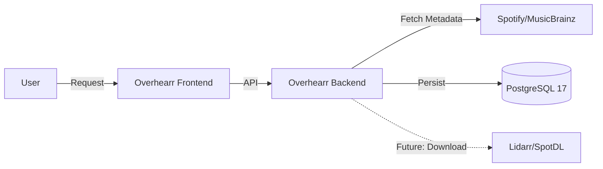

<div align="center">
  <h1>Overhearr</h1>
  <p>
    <strong>A self-hosted music request manager.</strong>
    <br />
    <em>(Currently in early development)</em>
  </p>

  <p>
    <a href="./LICENSE">
      
    </a>
    
    
    
  </p>
</div>

## About

**Overhearr** is a free and open source software application for managing requests for your music library. Inspired by tools like [Seerr](https://github.com/seerr-team/seerr/), Overhearr allows friends and family to request music (songs, albums, artists) which can then be automatically handled and downloaded to your self-hosted media server.

## Project Status

🚧 **This project is currently in the scaffolding phase.** The backend and frontend structures are set up with Docker, but the core logic for requests and authentication is currently being implemented.

### Features (MVP)
* **Request System:** Seamlessly search and request music using metadata from Spotify, Deezer, MusicBrainz, and Last.fm.
* **Authentication:** Secure, admin-managed user creation with JWT token-based login.
* **Dashboard:** A responsive interface to track request status, recent additions, and server health.
* **Responsive UI:** Built with React 19 and Tailwind 4 for modern experience on mobile and desktop.

## Roadmap

**Phase 1: MVP (In Progress)**
* [ ] **Authentication:** Admin-managed user creation with JWT token-based login.
* [ ] **Request System:** Search and request music using metadata from Spotify/Deezer.
* [ ] **Dashboard:** Responsive UI to track request status.
* [X] **Infrastructure:** Docker Compose setup with PostgreSQL, Spring Boot, and React.

**Phase 2: Integrations (Future)**
* [ ] **Download Clients:** Integration with Lidarr, SpotDL, and yt-dlp.
* [ ] **Media Servers:** Sync with Jellyfin, Plex, and Subsonic.
* [ ] **Notifications:** Email and Webhook support (Discord/Slack).

## Tech Stack

* **Frontend:** React 19, Tailwind CSS 4, Vite
* **Backend:** Java 25 (Eclipse Temurin), Spring Boot 4
* **Database:** PostgreSQL 17
* **Runtime:** Node.js 24 (Frontend build), Docker

## Architecture

Overhearr connects your external metadata sources with your internal media library.


## Getting Started

### Prerequisites
* Docker & Docker Compose
* Spotify Developer Client ID/Secret (for metadata fetching)

### Installation (Docker)

1.  **Clone the repository:**
    ```bash
    git clone https://github.com/lucasbmmn/Overhearr.git
    cd Overhearr
    ```

2.  **Configure Environment:**
    Copy the example environment file and fill in your details.
    ```bash
    cp .env.example .env
    ```

3.  **Run with Docker Compose:**
    ```bash
    docker-compose up -d
    ```
The application will be available at:
* **Frontend:** `http://localhost:FRONTEND_PORT` (Default: 80)
* **Backend API:** `http://localhost:FRONTEND_PORT/api/v1`

### Local Development

If you wish to run the stack without Docker for development:

**Backend:**
```bash
cd backend
./gradlew bootRun
```

**Frontend:**
```bash
cd frontend
npm install
npm run dev
```

## Configuration

Crucial environment variables for `.env`:

| Variable                | Description                |
|-------------------------|----------------------------|
| `POSTGRES_USER`         | PostgreSQL Username        |
| `POSTGRES_PASSWORD`     | PostgreSQL Password        |
| `SPOTIFY_CLIENT_ID`     | Your Spotify API Client ID |
| `SPOTIFY_CLIENT_SECRET` | Your Spotify API Secret    |

## Contributing

Contributions are what make the open-source community such an amazing place to learn, inspire, and create. Any contributions you make are greatly appreciated.

Please read [CONTRIBUTING.md](https://github.com/lucasbmmn/overhearr/blob/main/CONTRIBUTING.md) for details on the code of conduct, and the process for submitting pull requests.

## License
Distributed under the GNU Affero General Public License. See [`LICENSE`](https://github.com/lucasbmmn/overhearr/blob/main/LICENSE) for more information.